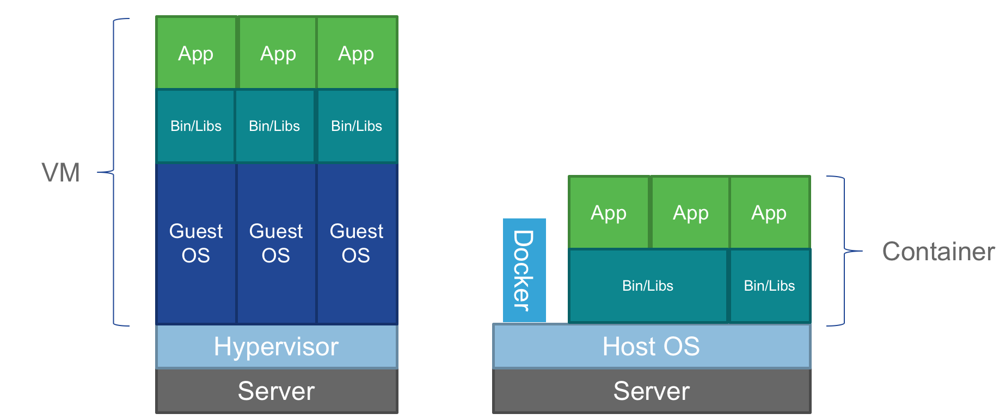

[item]: # (slide)
#Containers
###Why all the hype?

[item]: # (/slide)

[item]: # (slide)
##VMs vs Containers

* Virtual Machines Virtualize hardware
* Containers "Virtualize" the OS

[item]: # (/slide)

[item]: # (slide)
##Containers are not new
OS Level virtualization is not a new concept

* Solaris Zones
* FreeBSD jail
* VMware ThinApp

[item]: # (/slide)

[item]: # (slide)
##Why is Docker and Rocket making containers popular?
Virtualizing the OS is not a simple task.  We need to ensure that each user-space is isolated, file system, and maybe memory limits or CPU quotas.

This can get complicated.

Docker and Rocket provide and API to make all of this nearly transparent to the user.

[item]: # (/slide)

[item]: # (slide)
##Use Case - Webapp
Deploy 3 instances of the Blobfish Facts webapp

