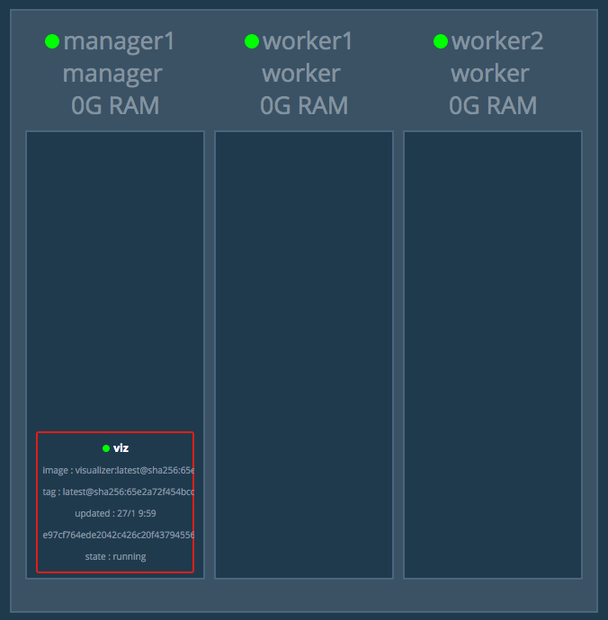
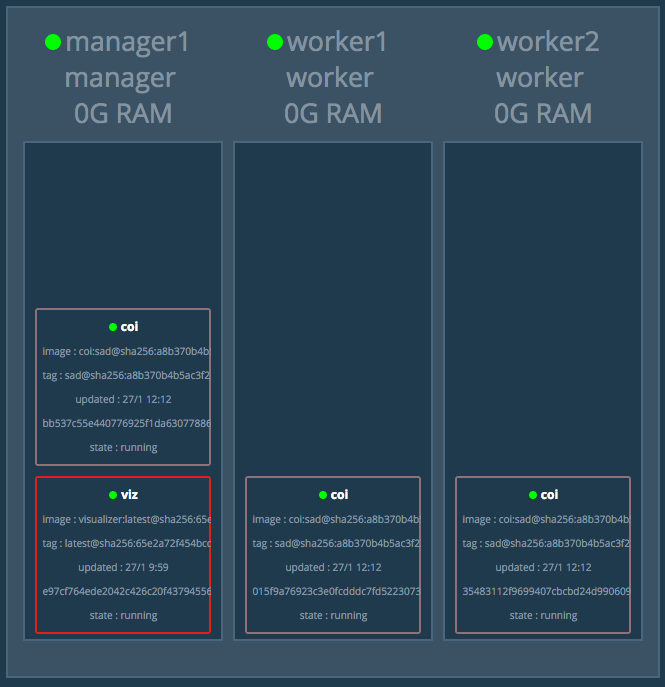
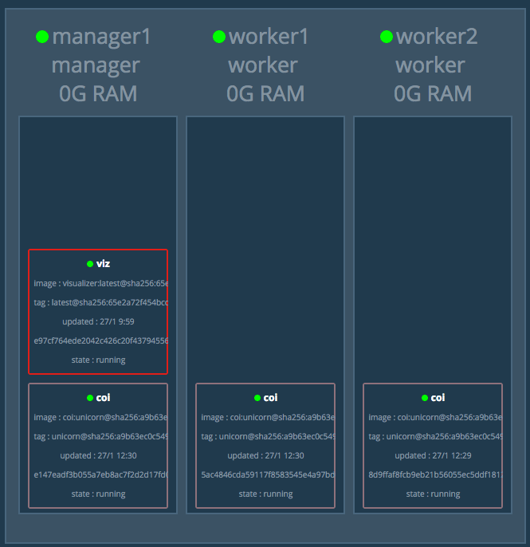

[item]: # (slide)
#Containers
###Why all the hype?

[item]: # (/slide)

[item]: # (slide)
##VMs vs Containers


* Virtual Machines Virtualize hardware
* Containers "Virtualize" the OS

[item]: # (/slide)

#Add - Container doesn't me no more VM"s

[item]: # (slide)
##Containers are not new
OS Level virtualization is not a new concept

* Solaris Zones
* FreeBSD jail
* VMware ThinApp

[item]: # (/slide)

[item]: # (slide)
##Why is Docker and Rocket making containers popular?
Virtualizing the OS is not a simple task.  We need to ensure that each user-space is isolated, file system, and maybe memory limits or CPU quotas.

This can get complicated.

Docker and Rocket provide and API to make all of this nearly transparent to the user.

[item]: # (/slide)


[item]: # (slide)
##Use Case - Webapp
Deploy 3 instances of the Blobfish Facts webapp

```
http://github.com/chapeter/coi
```

Python Flask app

[item]: # (/slide)

[item]: # (slide)
##Install Without Containers

* Build physical or virtual server
* Download code
  ```
  git clone http://github.com/chapeter/coi
  ```
* Setup environment
  * Install correct version of Python<br>


    ```
    $ wget https://www.python.org/ftp/python/2.7.13/Python-2.7.13.tg
    --snip--
    $ tar xzf Python-2.7.13.tgz
    --snip--
    $ cd Python-2.7.13
    $ sudo ./configure
    $ sudo make altinstall
    --snip--
    $ python2.7 -V
    Python 2.7.13
    ```  
    
[item]: # (/slide)

[item]: # (slide)

  * Install PIP

  ```
  $ wget https://bootstrap.pypa.io/get-pip.py
  
  $ python get-pip.py
  ```
  * Install Dependencies

  ```
  cd coi
  pip install -r requirements.txt
  ```
* Run webapp
  
  ```
  $ python coi.py
   * Running on http://0.0.0.0:5000/ (Press CTRL+C to quit)
  ```
* Repeat on each server
  
[item]: # (/slide)

[item]: # (slide)
##Install with Containers

[item]: # (/slide)

[item]: # (slide)

###Step 1
Create Dockerfile inside the project's base folder.  Think of this as build instructions.

```
FROM python:2.7.13-alpine

COPY . web/
WORKDIR web

RUN pip install -r requirements.txt

EXPOSE 5000
CMD ["python", "coi.py"]
```

[item]: # (/slide)

[item]: # (slide)

```FROM``` - indicates the base image

```:2.7.13-alpine``` - indicates a tag.  Here it means Python 2.7.13 based on Alpine Linux

```COPY``` - copies the current directly into another directory inside the container

```WORKDIR``` - changes working directory (cd)

```RUN``` - This is a command run during the build process

```EXPOSE``` - This indicate the port the container is listening on

```CMD``` - This is the command run at container runtime (can be overridden)

[item]: # (/slide)

[item]: # (slide)

###Step 2
Build the image

```
docker build -t chapeter/coi
```

```
-t <repositoryname>:<tag>
```
The tag flag can be used to set a repo and name for your.  In our case I'm using ```chapeter/coi``` as the repository, and without indicating a ```tag``` it implies ```:latest```

[item]: # (/slide)

[item]: # (slide)

###Step 3
Upload image to repository

```
docker push chapeter/coi
```

By default docker will use hub.docker.com, but you can set your own private or public repositories.

[item]: # (/slide)

[item]: # (slide)

###Step 4
At this point we are ready for deployment.  We have multiple options.  At a very basic level we can deploy a container on 3 servers using docker.

On each server run:

```
docker run -d -p 80:5000 chapeter/coi:latest
```

```-d``` - Run in detached mode (run in background)

```-p``` - Publish port.  In our case we are mapping server port 80 to container port 5000.  Think of this like a NAT

[item]: # (/slide)

[item]: # (slide)
###Alternate Step 4
Deploy container as a service in a cluster.  Here we will use Docker Swarm.



[item]: # (/slide)

[item]: # (slide)

```
$ docker service create -p 80:5000 \
  --replicas 3 --name=coi chapeter/coi:latest
```


< 5 seconds

[item]: # (/slide)

[item]: # (slide)
##Updating Apps with Containers
With Containers we do update the application like we normally would with patching etc.  Here we simply redeploy using a new container built from an image with updated code.

[item]: # (/slide)

[item]: # (slide)

###Step 1
"Save" the current state of our repo

```
$ docker build -t chapeter/coi:sad

$ docker push chapeter/coi:sad
```

[item]: # (/slide)

[item]: # (slide)

###Step 2
Make our code changes.  In this example I'm going to change the image shown on the webapp.

[item]: # (/slide)

[item]: # (slide)
###Step3
Build new image with new tag, as well as ```latest```:

```
$ docker build -t chapeter/coi:unicorn

$ docker build -t chapeter/coi:latest
```

[item]: # (/slide)

[item]: # (slide)
###Step 4
Publish images

```
$ docker push chapeter/coi:unicorn

$ docker push chapeter/coi:latest
```

[item]: # (/slide)

[item]: # (slide)

###Step 5
Update Swarm Service

```
$ docker service update --image chapeter/coi:unicorn coi
```



[item]: # (/slide)


[item]: # (slide)
##Still...why do I care?
Cloud Center

AppDynamics

APIC Apps

NxOS apps

[item]: # (/slide)

#More info
[Imapex training on Advance Docker](https://github.com/imapex-training/mod_adv_docker)